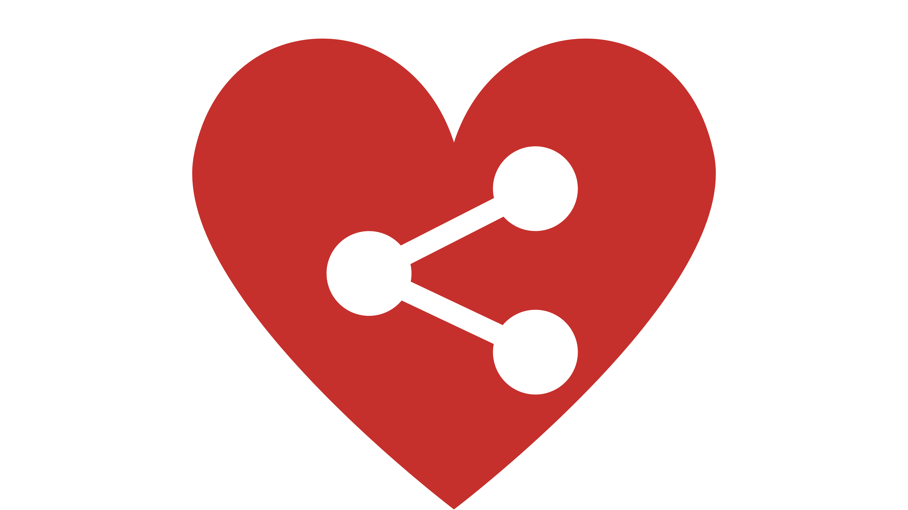
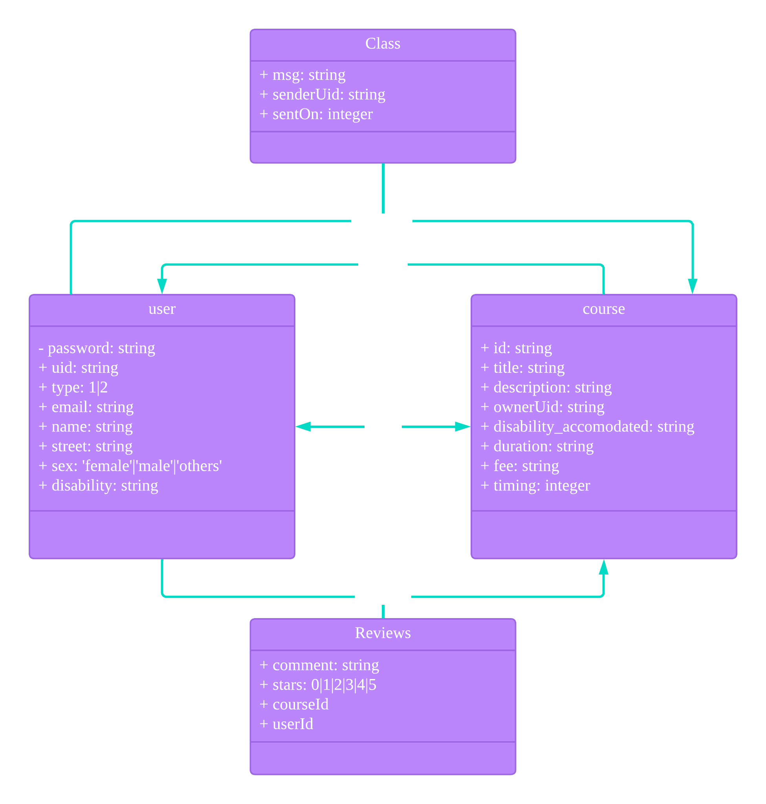

#  HeartShare

> Submission for Hack for Good 2023 under **Pillar 1**

## Problem statement

How might we, as a community empower, equip and co-create with persons with disabilities to enable them to access, use and enjoy places, services, produces and/or information, whether physical or virtual, so that persons with disabilities can connect to and be included in the wider community?

## What is it?

A web application with an emphasis on inclusivity, and accommodation that allows persons with or without disabilities alike to conduct classes catered for other persons with disabilities.

## Techstacks Used

### Frontend
* React.JS
* MaterialUI

### Backend
> More information about backend can be found in `README.md` in `backend/`
* Express.JS
* Node.JS
* Firebase
    * Cloud Firestore
    * Firebase functions
    * Firebase authentication

## Installation and setup

### Startup frontend
1. Open a new terminal and cd into `frontend/` folder
1. Run the following
```
npm install
npm start
```

### Startup backend
1. Open a new terminal and cd into the `backend/` folder
1. Run the following
```
npm install
npm install -g firebase-tools
firebase serve
```

## Entity relation diagram
